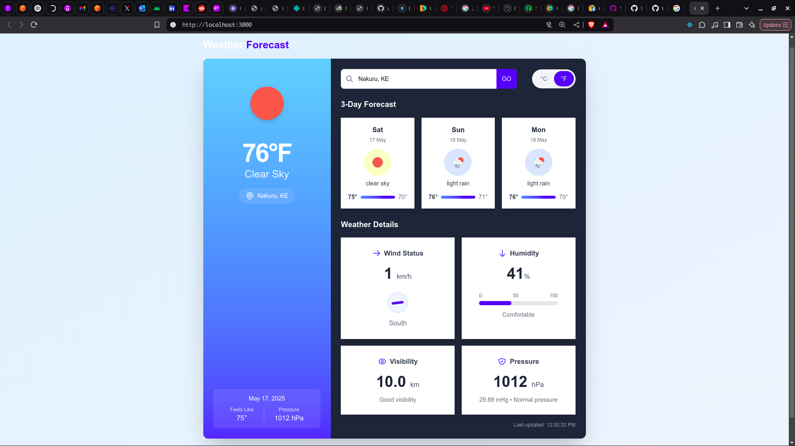

# Weather App

This repository contains a full-stack weather application with a Laravel backend and a Next.js frontend.



## System Requirements

- Docker and Docker Compose
- Git

## Project Structure

The application consists of two main components:

- **Backend**: Laravel PHP application with OpenWeather API integration
- **Frontend**: Next.js application

## Setup Instructions

### 1. Clone the Repository

```bash
git clone <repository-url>
cd weather-app
```

### 2. Environment Configuration

Create a `.env` file in the root directory with the following variables:

```
APP_KEY=
OPENWEATHER_API_KEY=your_openweather_api_key_here
```

You can obtain an OpenWeather API key by signing up at [OpenWeather](https://openweathermap.org/api) (required for weather data).

### 3. Start the Application

Build and start the Docker containers:

```bash
docker-compose up -d
```

This command will:
- Build both backend and frontend images
- Start the containers in detached mode
- Set up the necessary network

### 4. Access the Application

Once the containers are running:

- Frontend: http://localhost:3000
- Backend API: http://localhost:8000

## Container Details

### Backend Service

- **Technology**: PHP 8.2 with Apache
- **Framework**: Laravel
- **Port**: 8000 (mapped to container port 80)
- **API Endpoints**: Documentation available at the backend URL

### Frontend Service

- **Technology**: Node.js with Next.js
- **Port**: 3000
- **Dependencies**: Managed with pnpm

## Development Workflow

### Backend Development

To make changes to the backend:

1. Edit files in the `./weather-app-backend` directory
2. Changes are automatically reflected due to volume mounting

For running Artisan commands:

```bash
docker-compose exec backend php artisan <command>
```

### Frontend Development

To make changes to the frontend:

1. Edit files in the `./weather-app-frontend` directory
2. Changes are automatically reflected due to volume mounting

For running npm/pnpm commands:

```bash
docker-compose exec frontend pnpm <command>
```

## Troubleshooting

### Permission Issues

If you encounter permission issues with storage directories:

```bash
docker-compose exec backend chmod -R 777 storage/
docker-compose exec backend chmod -R 775 bootstrap/cache/
```

### Backend Connection Issues

If the frontend cannot connect to the backend:
- Ensure both containers are running: `docker-compose ps`
- Check the NEXT_PUBLIC_BACKEND_URL environment variable
- Verify network connectivity: `docker network inspect weather-network`

### Container Logs

To view logs from the containers:

```bash
# Backend logs
docker-compose logs backend

# Frontend logs  
docker-compose logs frontend
```

## Stopping the Application

To stop the running containers:

```bash
docker-compose down
```

To remove all containers and networks:

```bash
docker-compose down -v
```
